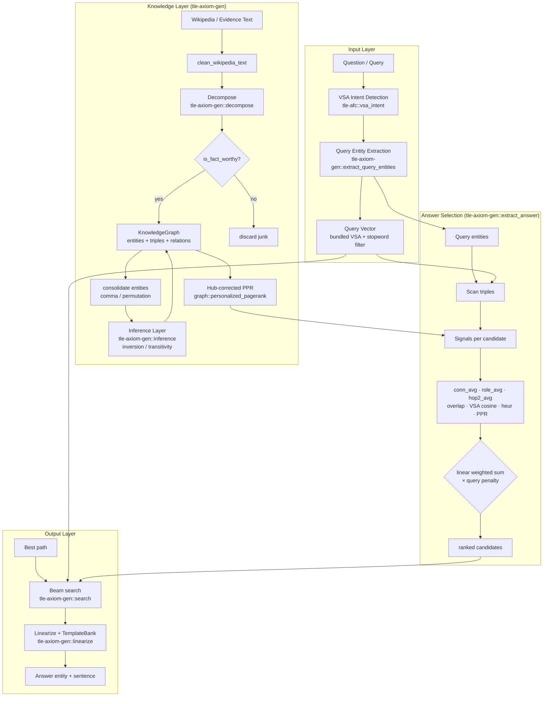

# AXIOM — Algebraic neXt-token Inference On Memory

> Solve for X. No training required.

**AXIOM** is a deterministic, CPU-only, zero-training question-answering and
reasoning system built on hyperdimensional vectors (VSA) + a knowledge graph.
Every number below is measured on a real benchmark — see **Honest Status** for
what the numbers do and do NOT mean.

## Status (2026-08-11 · v15)

| Metric | Value | What it measures |
|--------|:---:|------|
| TriviaQA candidate answer | **24.53%** | AXIOM picks the correct entity |
| Answer entity recall | **76.10%** | Correct answer is a graph node |
| Substring accuracy | **23.27%** | Answer appears in generated sentence |
| Evidence answer recall | **99.69%** | Answer exists in ingested evidence |
| Latency | ~100ms | Full evidence ingest + answer |

**The honest reading:** with evidence pre-ingested (recall 99.69%), AXIOM can
*find* the right answer 76% of the time but *select* it only 24.53%. The
52pt gap between finding and selecting is the open research problem. This is a
**pipeline diagnostic on evidence-ingested data — NOT an open-domain benchmark
score.** Standard TriviaQA EM/F1 equivalents would be lower.

## What Works (verified)

- **1-hop & some multi-hop reasoning** on taught facts:
```
AXIOM> /teach sky is blue
AXIOM> /teach blue has short wavelength
AXIOM> why is the sky blue?
  A sky is blue, because the blue has short wavelength. [633µs]
```
- **Deterministic**: same input → same output, always. No sampling.
- **Instant learning**: `/teach` a fact → answerable in µs.
- **Zero training**: no gradients, no backprop, CPU-only, ~18MB.

## What Does NOT Work Yet (honest)

- **"does cat have a heart?" fails** when taught `animals have hearts` —
  the system does not reliably chain `cat is an animal` → `animals have hearts`.
  It is key-value lookup + shallow traversal, **not** real compositional reasoning.
- **Open-domain QA is weak** (24.53% candidate). The 52pt gap is the bottleneck.
- **No LLM-style conversation.** Output is formulaic; it cannot free-form chat.
- **VSA cosine with a random codebook is near-noise** (N(0,1/√2048)) — it cannot
  be a primary signal; it only works as a weak tiebreaker.

## Recent Progress (v14 → v15, all bench-verified)

| Change | Type | Result |
|--------|------|--------|
| Proper-noun boundary precision | decomposition | recall +4.72pt |
| Query-entity punctuation fix | bug-fix at a gate | candidate +2.2pt |
| Hub-corrected PPR (relative PageRank) | new structural signal | candidate +0.63pt |
| Subject resolution (copula handling) | decomposition | candidate +0.32pt |
| Overlap weight calibration | tuning | candidate +0.63pt |

**What did NOT work (6 documented rounds):** weight tuning (flat local optimum),
percentile/rank fusion, conformal p-value fusion, IEF, relation-heuristic type
veto, graph-surface filters. All reverted and recorded in
`docs/LESSONS_LEARNED.md` so they are never re-tried. Full analysis in
`docs/SESSION_RESEARCH_SUMMARY.md`.

## Try It

```bash
cargo build --release

# Interactive REPL
cargo run --release -p tle-deepman

# TriviaQA diagnostic (evidence-ingested)
./target/release/triviaqa-bench data/triviaqa/qa/verified-wikipedia-dev.json \
  - data/triviaqa/evidence/wikipedia

# Tests (75+ pass)
cargo test -p tle-axiom-gen
```

## Architecture

### System Overview (data flow)



### Scoring Detail (extract_answer)

```mermaid
flowchart LR
    subgraph S["Candidate Entity e"]
        S1[conn_avg<br/>avg connectivity to query]
        S2[role_avg<br/>Who→subject / What→object]
        S3[hop2_avg<br/>2-hop bonus]
        S4[overlap<br/>question words in name]
        S5[VSA cosine<br/>weak, N(0,1/√2048) noise]
        S6[heur<br/>0.2·count − len + cap + det]
        S7[PPR<br/>log π_q(e) − log π(e)]
    end

    S1 --> SCORE{score(e) =<br/>Σ wᵢ·signalᵢ<br/>× query_penalty}
    S2 --> SCORE
    S3 --> SCORE
    S4 --> SCORE
    S5 --> SCORE
    S6 --> SCORE
    S7 --> SCORE

    SCORE --> QP{query-named?}
    QP -->|Where/When| P1[x 0.2]
    QP -->|What/Who| P2[x 0.6]
    QP -->|no| P3[x 1.0]
    P1 --> ANS[argmax → answer]
    P2 --> ANS
    P3 --> ANS
```

### Crate Map

```mermaid
graph TD
    subgraph Core["Core Math"]
        VSA[tle-vsa<br/>bind / bundle / permute / cosine]
        TRANS[tle-transition<br/>Transition Binding Algebra]
        RES[tle-resonator<br/>Resonator Networks]
        CLIFF[tle-clifford<br/>Geometric Algebra]
        TDA[tle-tda-router<br/>Topological routing]
    end

    subgraph Knowledge["Knowledge & Reasoning"]
        ENG[tle-engram<br/>O(1) n-gram hash]
        KNOW[tle-knowledge<br/>compressed VSA bundles]
        AFC[tle-afc<br/>incremental store · δ-mem<br/>analogy · attractor · intent]
        GEN[tle-axiom-gen<br/>KG · decompose · search<br/>extract_answer · inference]
    end

    subgraph LM["VSA Language Model (Path C)"]
        VSALM[tle-vsa-lm<br/>TBA · Engram · Reservoir<br/>KnowledgePrior · cosine decoder]
    end

    subgraph App["Applications"]
        DEEP[tle-deepman<br/>interactive REPL]
        CHAT[tle-chat<br/>original chatbot]
        PIPELINE[tle-pipeline<br/>orchestration]
        MEM[tle-memory<br/>persistent memory]
        DEC[tle-decoder<br/>token decoding]
        BENCH[tle-bench<br/>benchmarks]
    end

    VSA --> TRANS
    VSA --> RES
    VSA --> ENG
    VSA --> KNOW
    VSA --> GEN
    VSA --> VSALM
    AFC --> GEN
    KNOW --> AFC
    GEN --> DEEP
    VSALM --> DEEP
    TRANS --> VSALM
    ENG --> VSALM
    CHAT --> AFC
    PIPELINE --> GEN
    DEC --> DEEP
```

### Repo Layout (following katgpt-rs conventions)

```
topological-latent-engine/
├── Cargo.toml            # workspace root (18 crates)
├── crates/               # all workspace members
│   ├── tle-vsa/          #   core VSA math (bind/bundle/permute/cosine)
│   ├── tle-axiom-gen/    #   QA engine: decompose → KG → rank → answer
│   │   ├── src/decompose.rs   # evidence → structured facts
│   │   ├── src/graph.rs       # KG + PPR + adjacency
│   │   ├── src/engine.rs      # extract_answer scoring (env-tunable)
│   │   ├── src/inference.rs   # Datalog-style rules (inversion/transitivity)
│   │   └── src/bin/           # triviaqa-bench, vsalm-wiki, ...
│   ├── tle-vsa-lm/       #   non-neural LM (TBA+Engram+Reservoir)
│   ├── tle-afc/          #   incremental store, analogy, attractor, intent
│   └── ...               # 13 more crates (see Crate Map)
├── docs/                 # source-of-truth + research (see Research Docs)
│   ├── AGENT_HANDOFF.md          # current state + next steps
│   ├── LESSONS_LEARNED.md        # anti-pattern registry (don't re-try)
│   ├── ROOT_CAUSE_ANALYSIS.md    # why the selection gap exists
│   ├── SESSION_RESEARCH_SUMMARY.md
│   └── RANKING_RESEARCH_SYNTHESIS.md
├── data/                 # TriviaQA + corpora (gitignored if large)
├── scripts/              # weight-sweep A/B harness
└── README.md
```

### Performance

| Operation | Speed |
|-----------|:-----:|
| Fact recall (taught) | 2-11 µs |
| Yes/No reasoning | 42-140 µs |
| Compositional (multi-hop) | 350-633 µs |
| TriviaQA full answer | ~100ms (evidence ingest + rank) |

## Honest Limitations

- **Quality gap vs LLMs** — correct but formulaic; no free-form conversation.
- **TriviaQA numbers are internal diagnostics** on evidence-ingested data, not
  standard open-domain EM/F1. Treat them as pipeline health, not a leaderboard.
- **Knowledge must be taught or ingested** — knows nothing by default.
- **Decomposition still noisy** (~30% junk) — the main lever for recall.
- **Answer selection is the open gap** (76% find → 24% select) — the active
  research focus. See `docs/RANKING_RESEARCH_SYNTHESIS.md`.
- **English only** (Thai planned).
- **No creative writing** — composes facts, cannot tell stories.

## Research Docs

- `docs/AGENT_HANDOFF.md` — current state + next steps (read first)
- `docs/LESSONS_LEARNED.md` — anti-pattern registry (what NOT to re-try)
- `docs/ROOT_CAUSE_ANALYSIS.md` — cross-layer analysis of the selection gap
- `docs/SESSION_RESEARCH_SUMMARY.md` — this session's 6 negatives + 4 gains
- `docs/RANKING_RESEARCH_SYNTHESIS.md` — deep research on ranking math
- `docs/RESEARCH_PAPER_DRAFT.md` — TBA + AXIOM-Gen paper draft

## License

MIT
